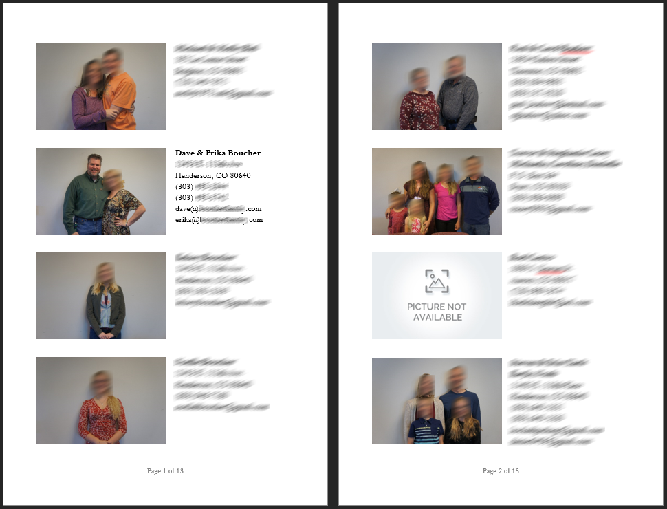
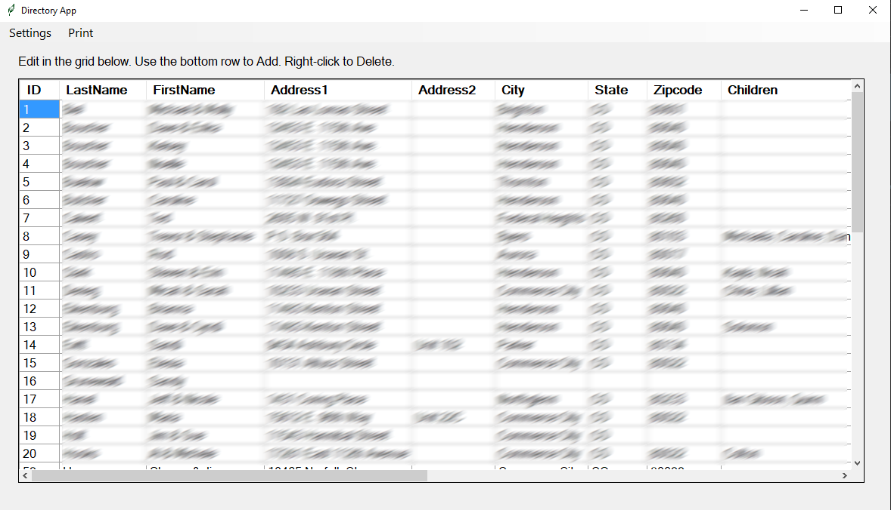
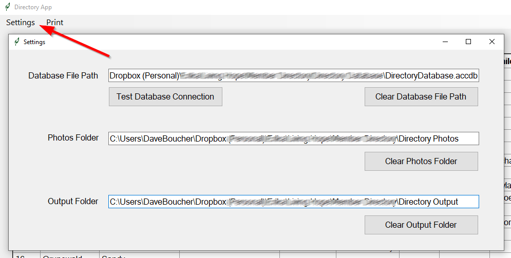
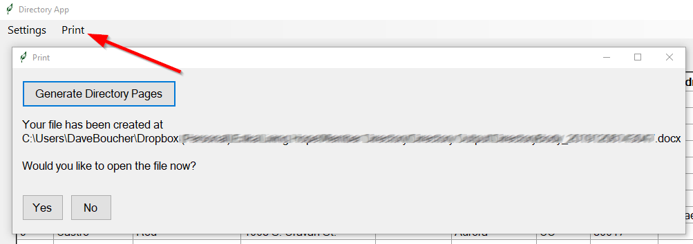
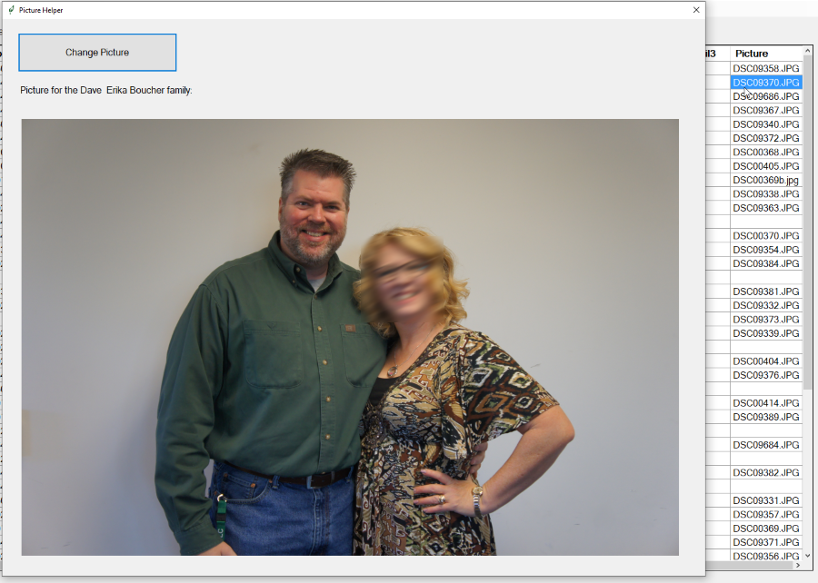
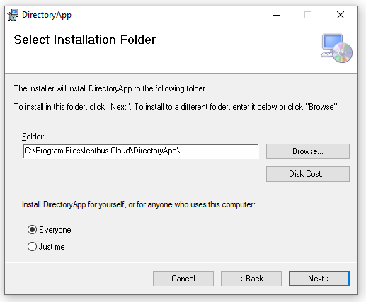

## Intro / Approach
This is a super quick and simple church directory program.

This is not intended to impress anyone.  These technologies were selected simply for expediency.  I wanted the path of least resistance to create a little app for my lovely wife to use when creating and maintaining a picture directory for our church.  This is not intended to be multi-tenant or really distributed in any way.  Rather, I just want to get better at putting little apps like this into repos.

I'm using WinForms _(Yuck!)_ and... wait for it... an MS Access database _(Gasp!)_.  Again... expediency!  I wanted to take advantage of some of the built-in features of MS Word for doing booklet formatting and pagination so I'm using InteropServices to automate MS Office.

If time permits, I may rebuild this using other technologies, but for now, I'm just knocking this out really quickly.  Don't judge me!  :)

## The App
The main screen of the app is an editable grid view of the database.  Records can be edited inline, added (at the bottom of the grid), and deleted by right-clicking on a record in the grid.  The settings screen allows you to locate the database in the file system, as well as identify the folders where the photos live and where you would like the generated Word file to be created.

## Dependencies
As mentioned in the intro, this app has dependencies on Microsoft Access and Microsoft Word.  Both must be running on any machine that runs this software.  To get you started with the Database, there is an empty database in the \church-directory\Misc\Database folder in this repo.  This database file has the required `Directory` table with the required columns.  Simply copy this file to a location on the client computer and point to it with the Settings in the application and you're ready to go.

Additionally, there is a dependency on the "Microsoft Access Database Engine 2010 Redistributable" located here:  https://www.microsoft.com/en-us/download/details.aspx?id=13255   Since this is older technology, I included the .exe files in the Misc/Dependencies folder in this repo.  I configured everything in this app to run 64 bit, but oddly the app only works when the 32 bit version of the DB engine is installed on the client machine.  I don't really have a desire to troubleshoot that since it works just fine.  I did some research on having dependent installs in the setup process, but felt that wasn't necessary at this point.  This is essentially a v1.  If this were ever to be distributed as an actual "product", then this would need to be buttoned up into the install process properly.

## Set Up Project Notes
The Solution has a Setup project.  After you make changes to the repo and you're ready to create a new install file, put the main DirectoryApp project in Release mode, then clean and rebuild it.  Then, put the Setup project in Release mode and rebuild it as well.  That rebuild of the Setup project will create Setup.exe and Setup.msi in the \church-directory\DirectoryApp\Setup\Release folder.  Both files are needed to install the Directory App onto a client machine.  You should run the Setup.exe file.  It, in turn, uses the Setup.msi file during the install.

## Screen Shots

**Output:**\
When you click the `Generate Directory Pages` button on the `Print` form, the system will use Office Automation to generate a paginated, booklet formatted Word document that is ready to print.  This will be the interior of the directory booklet.  Simply add your own custom cover page and you're good to go.  Records with no photo indicated will automatically have a `Picture Not Available` image.

**Main Screen:**\
The main screen of the app is an editable grid view of the database records.

**Settings Screen:**\
The Settings screen allows you to identify where the database and photos live, and you can indicate where you want the output Word document to go when saved.

**Print Screen:**\
The Print screen allows you to generate the output Word document.

**Picture Helper Screen:**\
When you click into the Picture field on the main data grid, a Picture Helper Screen will pop up.  This allows you to select and/or change the picture for the selected record.

**Installer:**\
Per the information in the `Setup Project Notes` section above, the Setup Project will generate install files you can use to deploy the program onto a client machine.

